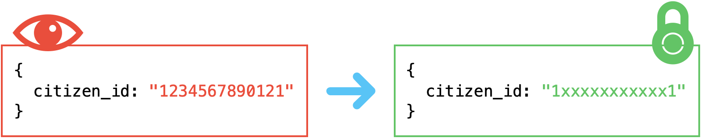

# Sensitive

[](http://golang.org)
[](https://github.com/owlsome-official)
[](https://github.com/owlsome-official/sensitive/actions/workflows/codeql.yml)

Sensitive is a middleware for [GoFiber](https://gofiber.io/) to blind sensitive value like mobile no, citizen id, etc. by defined configuration. Useful for security policies.



## Table of Contents

- [Sensitive](#sensitive)
  - [Table of Contents](#table-of-contents)
  - [Installation](#installation)
  - [Versions](#versions)
    - [v0.2.0 - `2024-02-13`](#v020---2024-02-13)
    - [v0.1.0 - `2023-02-14`](#v010---2023-02-14)
  - [Signatures](#signatures)
  - [Examples](#examples)
  - [Config](#config)
  - [Default Config](#default-config)
  - [Example Usage](#example-usage)

## Installation

```bash
  go get -u github.com/owlsome-official/sensitive
```

## Versions

### v0.2.1 - `2024-04-17`

- Updated dependencies and module version

### v0.2.0 - `2024-02-13`

- Updated dependencies and module version

### v0.1.0 - `2023-02-14`

- Blind text from `abcdefg` into `axxxxxg` (just show only the first and the last character with "x" as mark in the middle)
- Blinding by specific keys in response body
- Supported custom mark (default: "x")
- Debug Mode available via config `sensitive.New(sensitive.Config{ DebugMode: true })`

[...more](./CHANGELOG.md)

## Signatures

```go
func New(config ...Config) fiber.Handler
```

## Examples

```go
func main() {
  app := fiber.New()

  app.Use(sensitive.New(sensitive.Config{}))
  
  // ... Handlers ...
}
```

## Config

```go
// Config defines the config for middleware.
type Config struct {
  // Optional. Default: nil
  Next func(c *fiber.Ctx) bool

  // Required. Default: []
  Keys []string

  // Optional. Default: "x"
  Mark string

  // Optional. Default: false
  DebugMode bool
}
```

## Default Config

```go
var ConfigDefault = Config{
  Next:      nil,
  Keys:      []string{},
  Mark:      "x",
  DebugMode: false,
}
```

## Example Usage

Check it out! [example/README.md](./example/README.md)

---
made by ❤️ [owlsome-official](https://github.com/owlsome-official)
