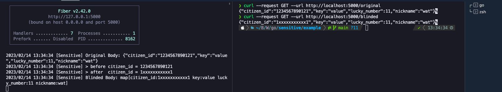

# Example Usage

## ☝️ Table of Contents

- [Example Usage](#example-usage)
  - [☝️ Table of Contents](#️-table-of-contents)
  - [Example `sensitive` middleware](#example-sensitive-middleware)
  - [⚙ Get Started](#-get-started)
    - [Step 0: Clone \& Change Directory](#step-0-clone--change-directory)
    - [Step 1: Initialize](#step-1-initialize)
    - [Step 2: Go run `main.go` (App will listening on port 5000)](#step-2-go-run-maingo-app-will-listening-on-port-5000)
    - [Step 3: Make GET request on another `terminal`](#step-3-make-get-request-on-another-terminal)
  - [Example output](#example-output)
  - [Tips: "Quality of Life" with](#tips-quality-of-life-with)

## Example `sensitive` middleware

```go
func main() {
  app := fiber.New()

  app.Use(sensitive.New(sensitive.Config{
    Keys: []string{
      "citizen_id",
    },
  }))
  
  // ... Handlers ...
}
```

## ⚙ Get Started

### Step 0: Clone & Change Directory

```bash
git clone https://github.com/owlsome-official/sensitive.git && cd sensitive/example
```

### Step 1: Initialize

```bash
  go mod tidy
```

### Step 2: Go run `main.go` (App will listening on port 5000)

```bash
  go run main.go
```

### Step 3: Make GET request on another `terminal`

```bash
# for original response
curl --request GET --url http://localhost:5000/original

# or

# for /blinded response
curl --request GET --url http://localhost:5000/blinded
```

## Example output



## Tips: "Quality of Life" with

- [VSCode Extension: REST Client](https://marketplace.visualstudio.com/items?itemName=humao.rest-client) to using `*.http` file for testing request
